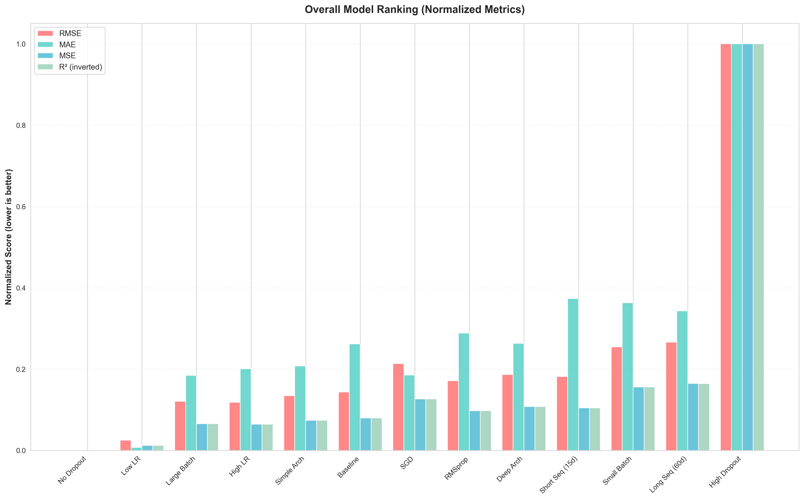
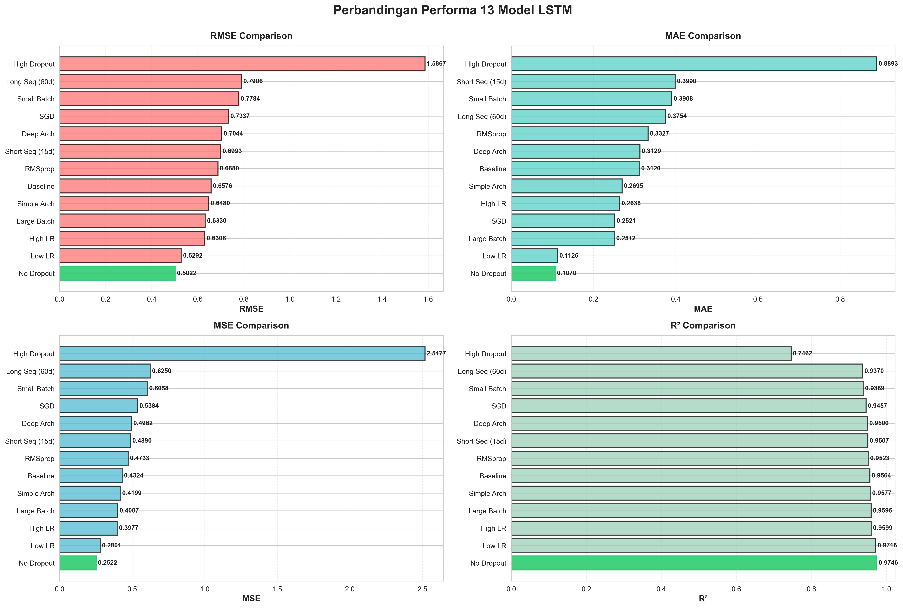
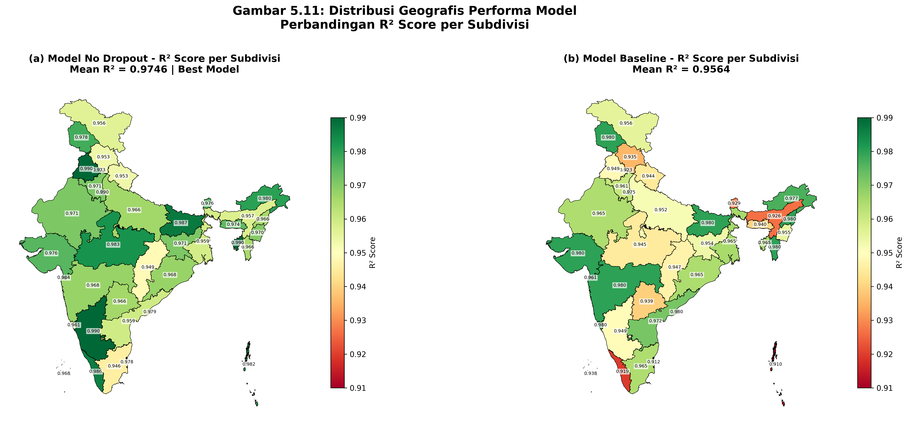
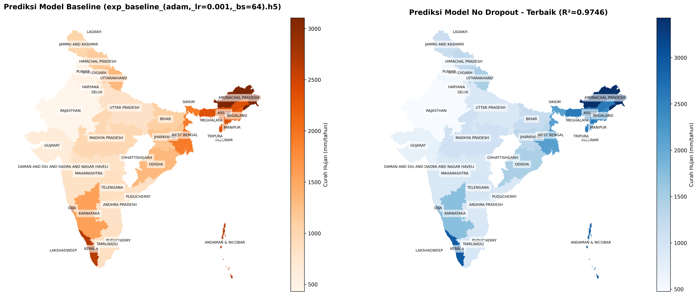

# Daily Rainfall Prediction in India Using LSTM

[](https://www.python.org/)
[](https://www.tensorflow.org/)
[](https://keras.io/)
[](https://jupyter.org/)
[](LICENSE)

[](https://scikit-learn.org/)
[](https://pandas.pydata.org/)
[](https://numpy.org/)
[](https://matplotlib.org/)

## Project Description

Implementation of **Long Short-Term Memory (LSTM)** model for daily rainfall prediction in India using 115 years of historical data (1901-2015). This project includes 13 comprehensive experiments with various hyperparameter configurations to find the optimal architecture.

### Highlights

- Dataset: 1.5+ million daily data points from 36 meteorological subdivisions in India
- 13 experiments with variations in learning rate, batch size, optimizer, architecture, and dropout
- Best model achieves **R² Score 0.9746** and **RMSE 0.5022 mm**
- Comprehensive model performance analysis with interactive visualizations

## Dataset

**Source**: [Rainfall in India 1901-2015](https://www.kaggle.com/datasets) - Kaggle

**Characteristics**:
- Period: 1901-2015 (115 years)
- Coverage: 36 meteorological subdivisions in India
- Total data points: 1,503,342 (after daily transformation)
- Format: Monthly rainfall time series transformed to daily

## Model Architecture

### Baseline Model

```
Input Layer: (sequence_length=30, features=1)
├── LSTM Layer 1: 64 units, return_sequences=True
├── Dropout: 0.2
├── LSTM Layer 2: 32 units
├── Dropout: 0.2
├── Dense Layer: 16 units, activation='relu'
└── Output Layer: 1 unit

Total Parameters: 29,857 (116.63 KB)
```

### Training Configuration

- **Loss Function**: Mean Squared Error (MSE)
- **Optimizer**: Adam (lr=0.001)
- **Batch Size**: 32
- **Epochs**: 100 (with early stopping patience=10)
- **Train/Test Split**: 80/20 (chronological)

## Experimental Results

### Comparison of 13 Models



| Rank | Model | RMSE | MAE | R² Score |
|------|-------|------|-----|----------|
| 1 | No Dropout | 0.5022 | 0.1070 | **0.9746** |
| 2 | Low LR (0.0001) | 0.5292 | 0.1126 | 0.9718 |
| 3 | High LR (0.01) | 0.6306 | 0.2638 | 0.9599 |
| 4 | Large Batch (128) | 0.6330 | 0.2512 | 0.9596 |
| 5 | Simple Arch (32-16-8) | 0.6480 | 0.2695 | 0.9577 |
| 6 | Baseline | 0.6576 | 0.3120 | 0.9564 |
| 7 | RMSprop | 0.6880 | 0.3327 | 0.9523 |
| 8 | Short Seq (15d) | 0.6993 | 0.3990 | 0.9507 |
| 9 | Deep Arch (128-64-32) | 0.7044 | 0.3129 | 0.9500 |
| 10 | SGD | 0.7337 | 0.2521 | 0.9457 |
| 11 | Small Batch (16) | 0.7784 | 0.3908 | 0.9389 |
| 12 | Long Seq (60d) | 0.7906 | 0.3754 | 0.9370 |
| 13 | High Dropout (0.5) | 1.5867 | 0.8893 | 0.7462 |

### Performance Visualization



### Geographic Performance Distribution



### Top 2 Models Comparison



## Key Insights

### 1. Dropout Effect
- Model **without dropout** shows the best performance
- Large dataset (1.5M sequences) prevents overfitting
- Excessive dropout (0.5) actually harms performance

### 2. Learning Rate Effect
- **Low LR (0.0001)**: Stable convergence, second-best performance
- **High LR (0.01)**: Fast convergence but less stable
- Low learning rate is optimal for complex datasets

### 3. Batch Size Effect
- **Large batch (128)**: Fast training, good performance
- **Small batch (16)**: Excessive gradient noise, decreased performance
- Batch size 64-128 is optimal for large datasets

### 4. Architecture Effect
- **Simple architecture** (32-16-8) surprisingly performs well
- **Deep architecture** (128-64-32) is not always better
- Model capacity should match data complexity

### 5. Sequence Length Effect
- **30 days**: Optimal for capturing monthly patterns
- **15 days**: Context window too short
- **60 days**: Adds noise, decreased performance

## Project Structure

```
.
├── project-deep-learning-lstm-rainfall-in-india.ipynb  # Main notebook
├── comparison_13_models.ipynb                          # Comparison analysis
├── mapping_models.ipynb                                # Geographic visualization
├── rainfall in india 1901-2015.csv                     # Main dataset
├── district wise rainfall normal.csv                   # Normal rainfall data
├── El-Nino.csv                                         # El Niño data
├── model_comparison_results.csv                        # Experiment results
├── exp_baseline_(adam,_lr=0.001,_bs=64).h5            # Baseline model
├── exp_no_dropout.h5                                   # Best model
├── exp_low_lr_(adam,_lr=0.0001).h5                    # Rank 2 model
├── exp_high_lr_(adam,_lr=0.01).h5                     # High LR experiment
├── exp_large_batch_(bs=128).h5                        # Large batch experiment
├── exp_small_batch_(bs=32).h5                         # Small batch experiment
├── exp_simple_architecture_(32-16-8).h5               # Simple architecture
├── exp_deep_architecture_(128-64-32).h5               # Deep architecture
├── exp_high_dropout_(0.5).h5                          # High dropout experiment
├── exp_rmsprop_optimizer.h5                           # RMSprop optimizer
├── exp_sgd_optimizer.h5                               # SGD optimizer
├── exp_short_sequence_(15_days).h5                    # 15-day sequence
├── exp_long_sequence_(60_days).h5                     # 60-day sequence
├── model_ranking.png                                   # Ranking visualization
├── model_comparison_plots.png                          # Comparison plots
├── gambar_5_11_distribusi_geografis_performa.png      # Geographic distribution
├── comparison_2_models_map.png                         # 2-model comparison
├── LAPORAN_PROGRESS_DEEP_LEARNING.md                  # Full report
├── PRESENTASI_PROGRESS_DEEP_LEARNING.pdf              # Presentation slides
└── README.md                                           # This file
```

## Installation

### Requirements

```bash
pip install tensorflow==2.20.0
pip install pandas numpy scikit-learn
pip install matplotlib seaborn
pip install jupyter notebook
```

### Clone Repository

```bash
git clone <repository-url>
cd lstm-rainfall-prediction-india
```

### Download Dataset

```bash
python download_dataset.py
```

## Usage

### 1. Training Model

```python
from tensorflow.keras.models import Sequential
from tensorflow.keras.layers import LSTM, Dense, Dropout

# Build model
model = Sequential([
    LSTM(64, return_sequences=True, input_shape=(30, 1)),
    Dropout(0.2),
    LSTM(32, return_sequences=False),
    Dropout(0.2),
    Dense(16, activation='relu'),
    Dense(1)
])

model.compile(optimizer='adam', loss='mse')
model.fit(X_train, y_train, epochs=100, batch_size=32)
```

### 2. Load Best Model

```python
from tensorflow.keras.models import load_model

# Load best model (No Dropout)
model = load_model('exp_no_dropout.h5')

# Predict
predictions = model.predict(X_test)
```

### 3. Evaluation

```python
from sklearn.metrics import mean_squared_error, mean_absolute_error, r2_score
import numpy as np

# Calculate metrics
mse = mean_squared_error(y_test, predictions)
rmse = np.sqrt(mse)
mae = mean_absolute_error(y_test, predictions)
r2 = r2_score(y_test, predictions)

print(f"RMSE: {rmse:.4f} mm")
print(f"MAE: {mae:.4f} mm")
print(f"R² Score: {r2:.4f}")
```

## Evaluation Metrics

- **MSE (Mean Squared Error)**: Average squared error
- **RMSE (Root Mean Squared Error)**: Square root of MSE, in mm units
- **MAE (Mean Absolute Error)**: Average absolute error
- **R² Score**: Proportion of variance explained (0-1, higher is better)

## Technologies

- **Python 3.8+**: Main programming language
- **TensorFlow 2.20.0**: Deep learning framework
- **Keras**: High-level API for neural networks
- **NumPy**: Numerical computing
- **Pandas**: Data manipulation and analysis
- **Scikit-learn**: Preprocessing and evaluation metrics
- **Matplotlib & Seaborn**: Data visualization

## Contributing

Contributions are welcome! Please create a pull request or open an issue for:

- Bug fixes
- New features
- Documentation improvements
- New architecture experiments

## Roadmap

- [ ] Implement Bidirectional LSTM
- [ ] Attention mechanism for interpretability
- [ ] CNN-LSTM hybrid architecture
- [ ] Feature engineering with external data (El Niño, temperature)
- [ ] Ensemble methods from top-5 models
- [ ] Web application for interactive prediction
- [ ] REST API for model serving
- [ ] Cloud deployment (AWS/GCP/Heroku)

## License

This project is licensed under the [MIT License](LICENSE).

## References

1. Hochreiter, S., & Schmidhuber, J. (1997). Long short-term memory. Neural Computation, 9(8), 1735-1780.
2. Kumar, D., et al. (2022). LSTM-based rainfall prediction using spatial and temporal features. Journal of Hydrology, 608, 127634.
3. Poornima, S., & Pushpalatha, M. (2022). Rainfall prediction using deep learning techniques. Environmental Science and Pollution Research, 29(45), 67835-67856.
4. Mishra, V., et al. (2021). Deep learning for improved global precipitation forecasting. Nature Communications, 12(1), 1-12.

## Contact

For questions or collaboration, please contact:

- Email: [your-email@example.com]
- LinkedIn: [Your LinkedIn Profile]
- GitHub: [Your GitHub Profile]

---

**Built with** ❤️ **using TensorFlow and Keras**

*Deep Learning Project - India Rainfall Prediction*
